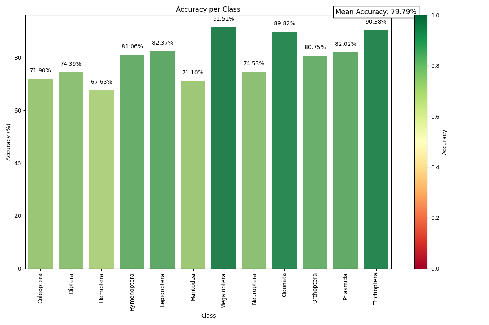
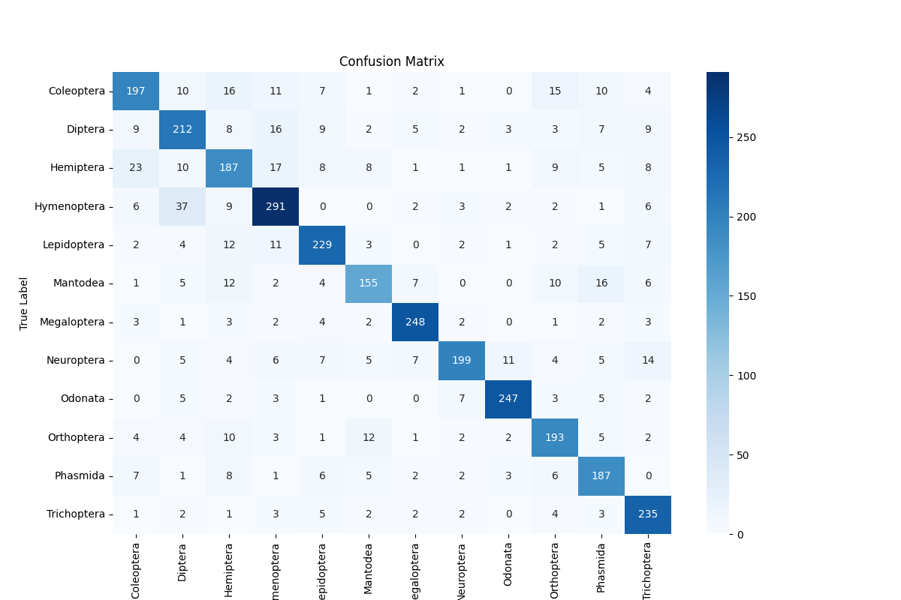
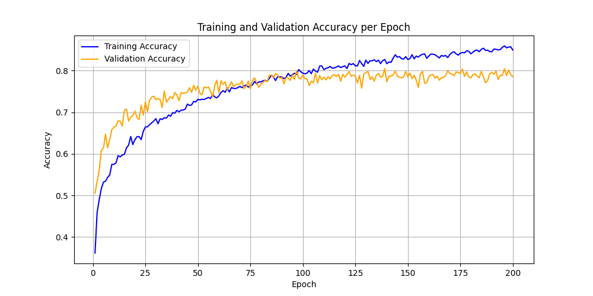

# Create our insect classification model : Tipu12

The main goal of our work was to classify 12 orders of insects :
- Coleoptera
- Diptera
- Hemiptera
- Hymenoptera
- Lepidoptera
- Mantodea
- Megaloptera
- Neuroptera
- Odonata
- Orthoptera
- Phasmida
- Trichoptera

We separated this task into 3 other tasks :
- download images ```/create_dataset```
- format the dataset ```/create_dataset```
- train the model ```/train_model```


## Results





