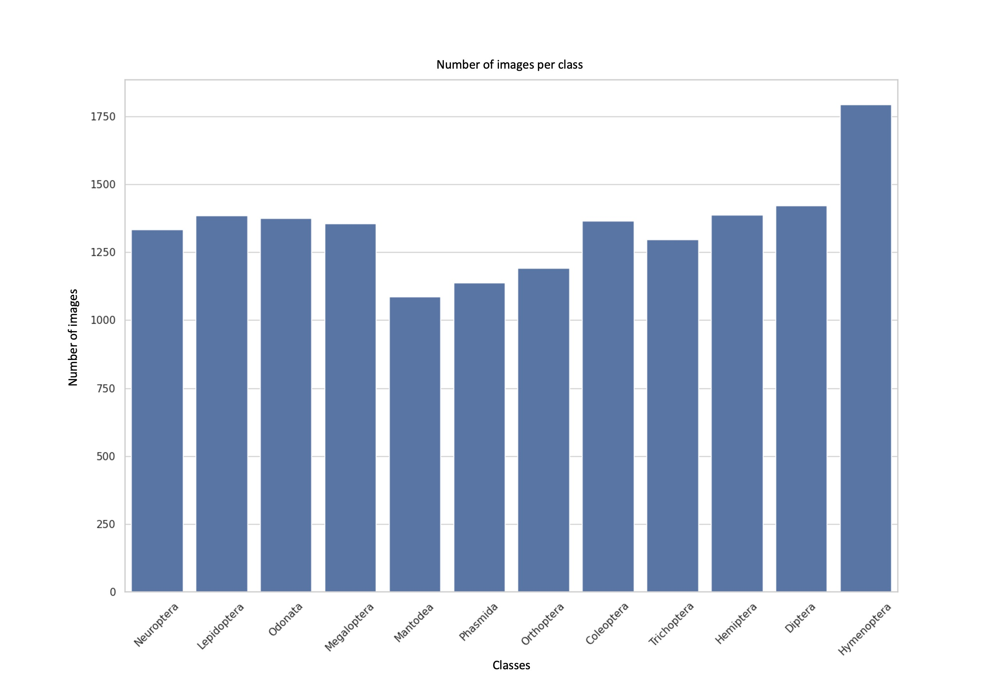

# Create dataset

Here is what we need to do to create the dataset :

- find and download images to compose the dataset
- crop all images around insects

## Download images

We downloaded our images from [iNaturalist](https://www.inaturalist.org/) which is an opensourced biodiversity images database.

The complete flow can be found in `download_images_from_inaturalist`.

## Crop images

To realize a good training of our AI model, we decided to download 18000+ images from iNaturalist to create the dataset. Due to time constraints, we couldn't crop images by hand. So we decided to train a detection model to detect insects in images and realize a crop around them.

The complete flow can be found in `train_yolov10n_insect_detection`.

## Some results

