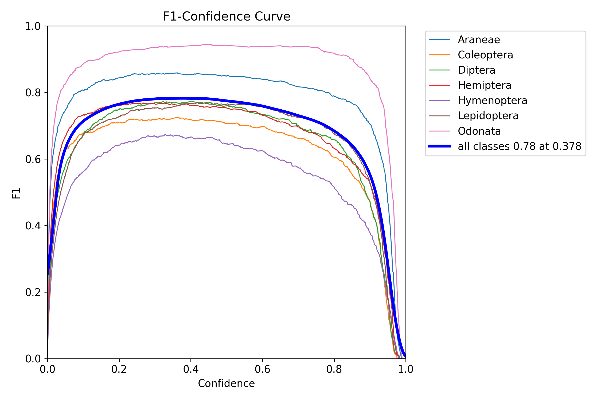
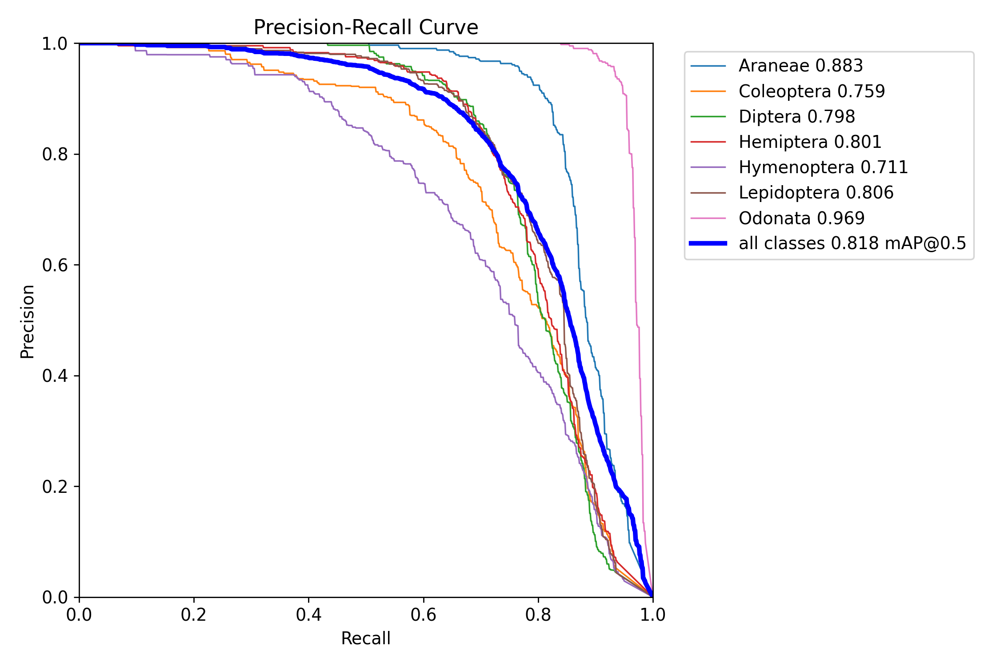
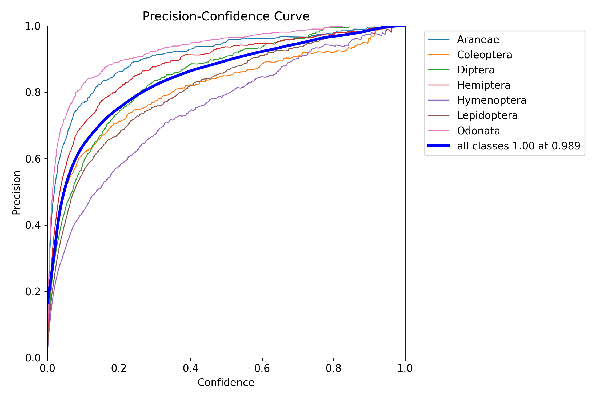
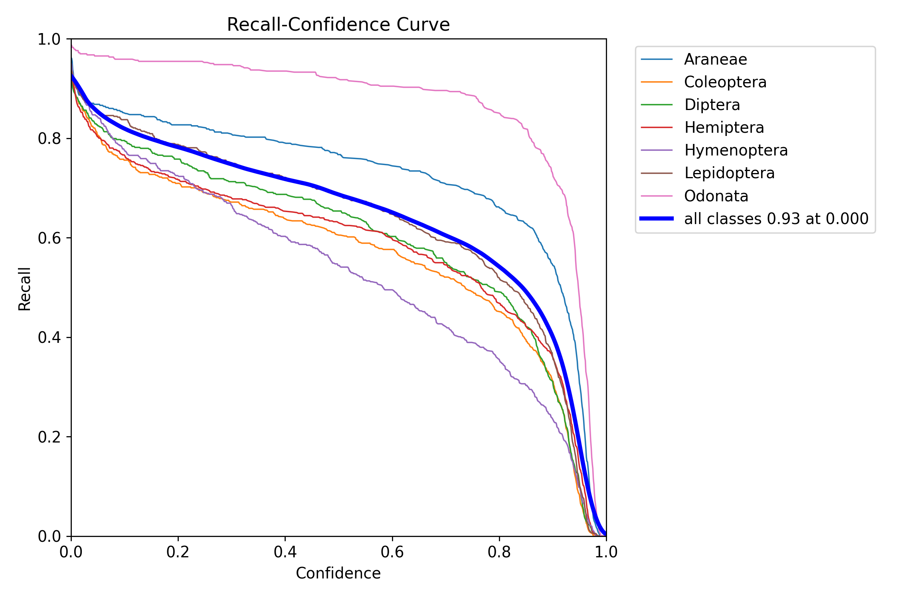
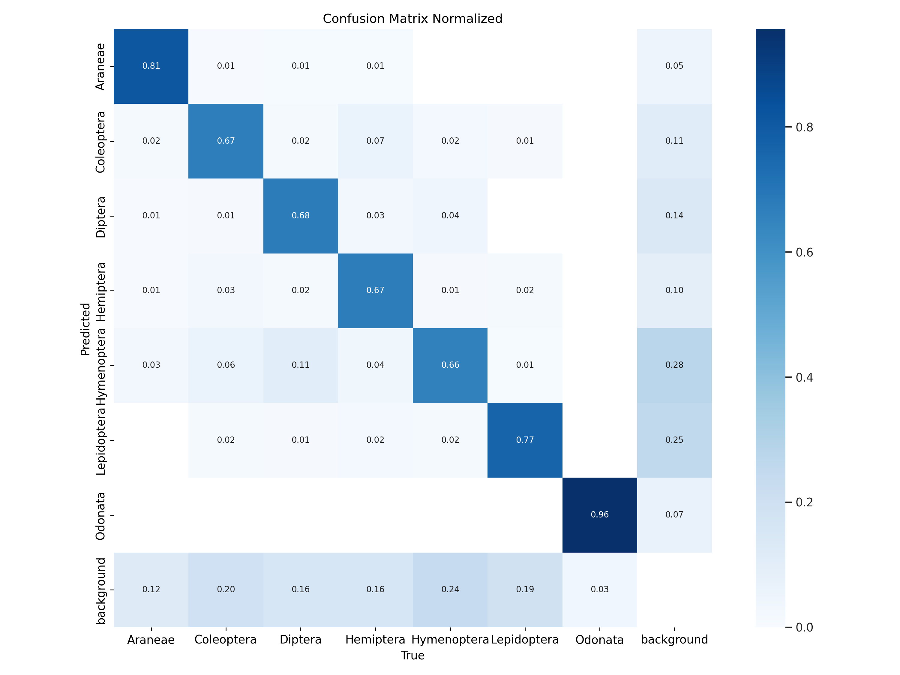

# Train Yolov10n on insect detection

Having to train locally on CPU, we searched for light CNN model. The Yolov10n only has 2.3 million params which makes it relatively light and it was doable for us to train it over a weekend. More information on Yolov10 [here](https://docs.ultralytics.com/models/yolov10/).  

## Find dataset
The closest dataset corresponding to our needs that we found is this one from kaggle : [Arthropod Taxonomy Orders Object Detection Dataset](https://www.kaggle.com/datasets/mistag/arthropod-taxonomy-orders-object-detection-dataset/code)

This dataset is not suited for training a Yolo model. So we have to adapt it.

## Format dataset

```organize_dataset.py``` reorganizes the dataset for the Yolo model. It mainly constists in converting the json labels into txt labels with only the name of the image and the coordinates of the box where the insect is located.

Then ```divide_into_train_and_val.py``` splits the dataset into a train folder and a validation folder.

The dataset is now ready for the training.

Additionally, you'll need a ```data.yalm``` file to start the training.


## Train model

```train_yolov10n_insect_detection.py``` trains the model using the ```ultralytics``` library and the pretrained weights ```yolov10n_pretrained.pt```.

You will get the weights of the model trained on the arthropod dataset and some metrics. In our case, due to time constraints, we stopped the training after 25 epochs. 


## Results

### Training Curves






### Confusion Matrix

As we can see on this matrix, our model struggles to classify the insects but detects correctly their presence with an accuracy of 84%. This makes it usable to process the Tipu12 dataset.

