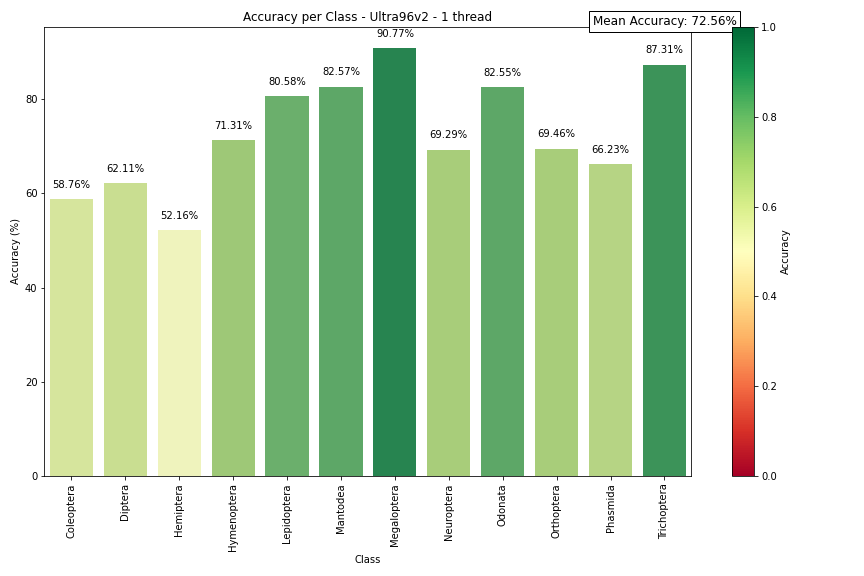
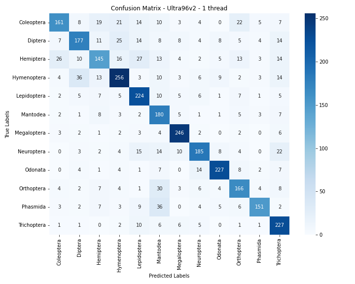

# Kria KV260 - Pynq DPU


## Setup the board

### 1. Create SD Card Image

The first step is to setup the SD Card Image : the process is detailed [here](https://www.amd.com/en/products/system-on-modules/kria/k26/kv260-vision-starter-kit/getting-started-ubuntu/setting-up-the-sd-card-image.html)

### 2. Install Pynq

Then, install Pynq. To do so connect in ssh to the board. 
```
ssh ubuntu@board_ip
```

To find the board ip
```
sudo arp-scan --localnet
```

Clone [this repository](https://github.com/Xilinx/Kria-PYNQ) on the board and run ```install.sh```
```
git clone https://github.com/Xilinx/Kria-PYNQ.git
cd Kria-PYNQ/
sudo bash install.sh -b KV260
```

This process can be long. This is perfectly normal. Once installed, you will be able to run Jupyter Lab on your browser. 

### 3. Run Jupyter Lab

Still connected in ssh to the board :
```
sudo su
source /etc/profile.d/pynq_venv.sh
cd $PYNQ_JUPYTER_NOTEBOOKS
jupyter lab --ip=0.0.0.0 --no-browser --allow-root
```

NB: If this doesn't work, reboot the board to take modifications into account.

### 4. Install Pynq-DPU

In a Jupyter Lab terminal, run :
```
pip3 install pynq-dpu --no-build-isolation
```

### 5. Copy hardware

Copy ```dpu.bit```, ```dpu.hwh``` and ```dpu.xclbin``` on the board. Don't rename these files and leave them in the same folder. If not, your board won't work.

Also copy your ```xmodel``` to use your AI application.


## Test inference on the board

```test_multithreading.ipynb``` is a notebook containing the whole flow to test our model Tipu12 on the Kria KV260 Vision AI Starter Kit :
- Prepare the overlay
- Load xmodel
- Preprocessing
- Using VART
- Testing accuracy and speed


The code was developped to work in multithreading. It will show and save a few metrics : accuracy per class, speed, confusion matrix, f1-score per class.

## Our results


