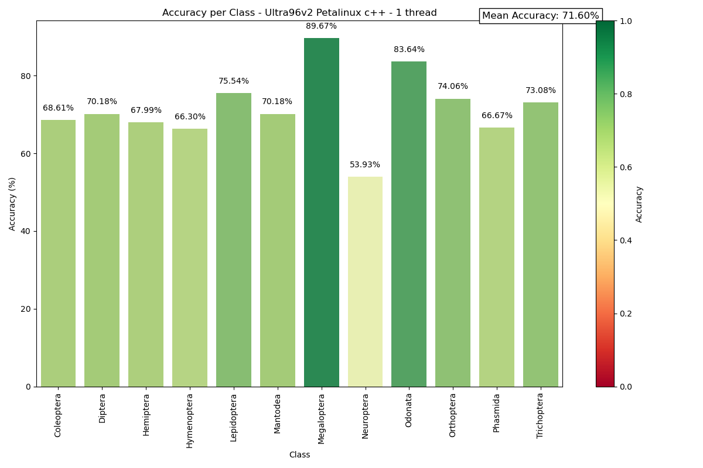

# Ultra96v2 - Petalinux C++

## Test speed and accuracy of the model

First, copy your ```xmodel```, ```build.sh``` and ```main.cpp``` on your board. Also import your test dataset.

Then execute the build :
```
./build.sh
```

And after, you can launch the main code :
```
./main /path/to/test/dataset num_threads
```

```main.cpp``` contains the whole flow to test our model Tipu12 on the Ultra96v2 :
- Load xmodel
- Preprocessing
- Using VART
- Testing accuracy and speed


The code was developped to work in multithreading. It will show and save a few metrics : accuracy per class, speed.


## Our results



