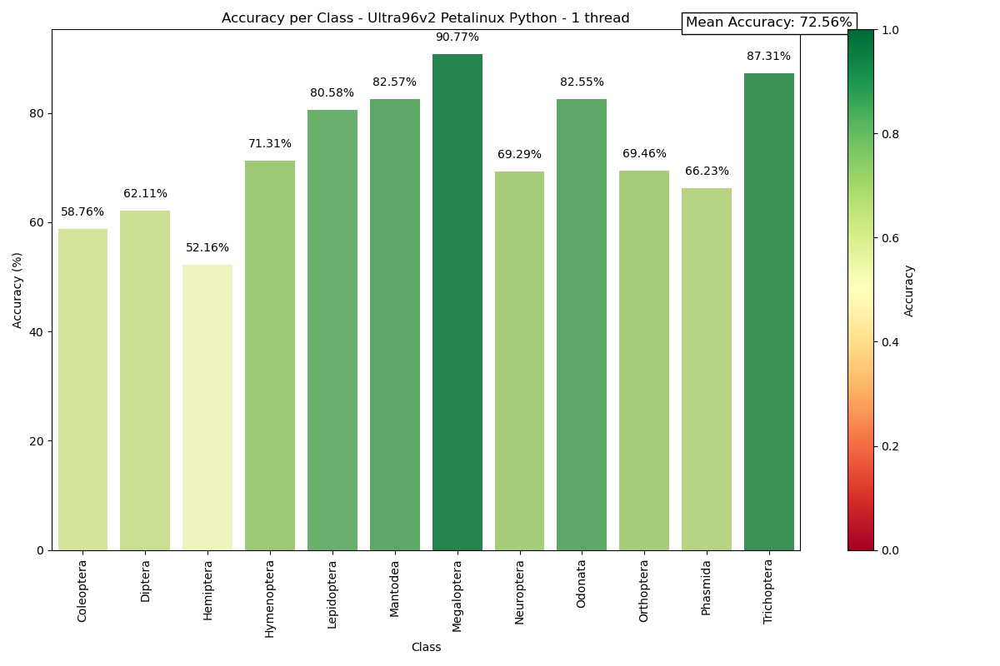
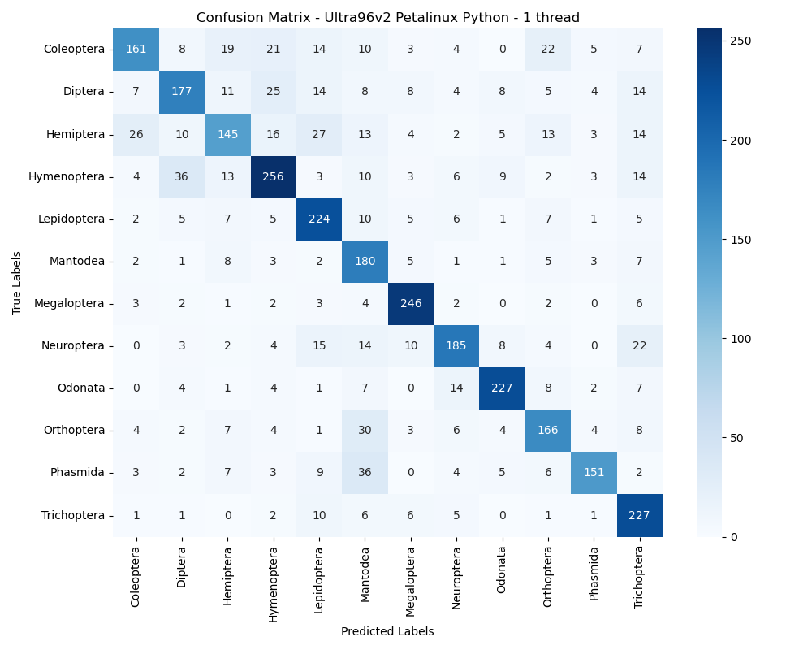

# Ultra96v2 - Petalinux Python

## Test speed and accuracy of the model

First, copy your ```xmodel``` and all python files on your board. Also import your test dataset.

Then execute the main :
```
python3 main.py /path/to/xmodel
```

```main.py``` contains the whole flow to test our model Tipu12 on the Ultra96v2 :
- Load xmodel
- Preprocessing
- Using VART
- Testing accuracy and speed


The code was developped to work in multithreading. It will show and save a few metrics : accuracy per class, speed, confusion matrix, f1-score per class.

If you wish to test your application on 1 thread, then 2 threads, and so on, then leave ```evaluate_on_thread_range = True```. Else, to test it specifically on a defined number of threads, change it to false.


## Our results




