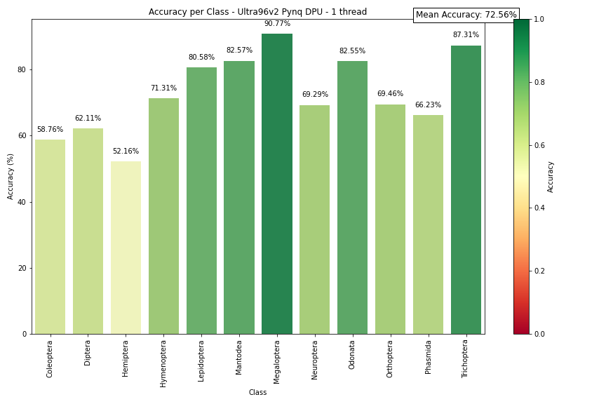
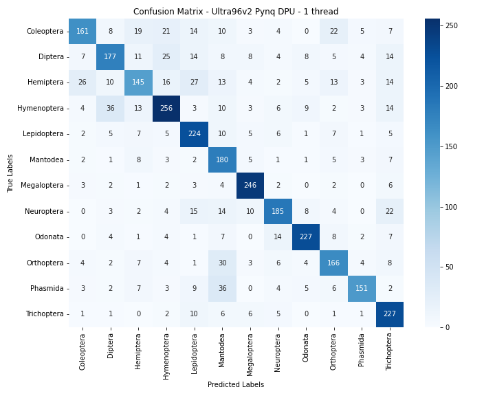
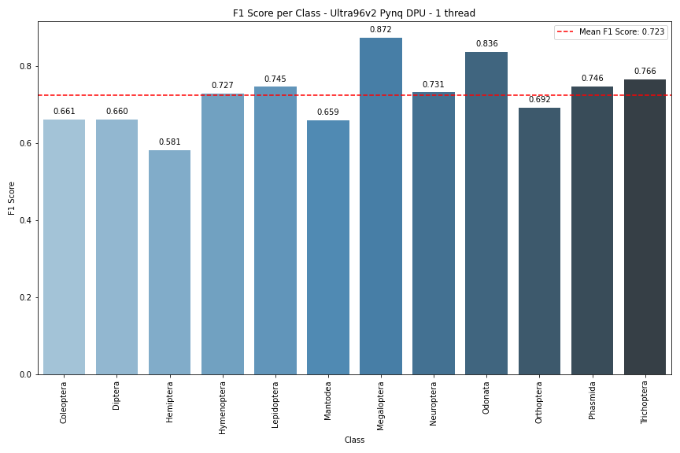

# Ultra96v2 - Pynq DPU


## Setup the board

### 1. Create SD Card Image

The first step is to setup the SD Card Image. This image can be found [here](http://www.pynq.io/boards.html).

Flash your SD card with this image using Balena Etcher.

Insert the card to the board and boot it.

### 2. Debug USB ethernet connection


### 2. Install Pynq-DPU

Connect in ssh to the board. 
```
ssh xilinx@192.168.3.1
```

Install pynq-dpu
```
sudo su
. /etc/profile.d/xrt_setup.sh
. /etc/profile.d/pynq_venv.sh
pip3 install pynq-dpu --no-build-isolation
```


### 3. Run Jupyter Lab

Every time you connect in ssh, you'll need to re-do the previous steps to run Jupyter Lab
```
ssh xilinx@192.168.3.1
sudo su
. /etc/profile.d/xrt_setup.sh
. /etc/profile.d/pynq_venv.sh
jupyter lab --ip=0.0.0.0 --no-browser --allow-root
```

Go to [http://192.168.3.1:9090/lab]

NB: If this doesn't work, try 8888 port
NB2: If this doesn't work, reboot the board to take modifications into account.


### 4. Copy hardware

Copy ```dpu.bit```, ```dpu.hwh``` and ```dpu.xclbin``` on the board. Don't rename these files and leave them in the same folder. If not, your board won't work.

Also copy your ```xmodel``` to use your AI application.


## Test inference on the board

```test_multithreading.ipynb``` is a notebook containing the whole flow to test our model Tipu12 on the Kria KV260 Vision AI Starter Kit :
- Prepare the overlay
- Load xmodel
- Preprocessing
- Using VART
- Testing accuracy and speed


The code was developped to work in multithreading. It will show and save a few metrics : accuracy per class, speed, confusion matrix, f1-score per class.

## Our results



