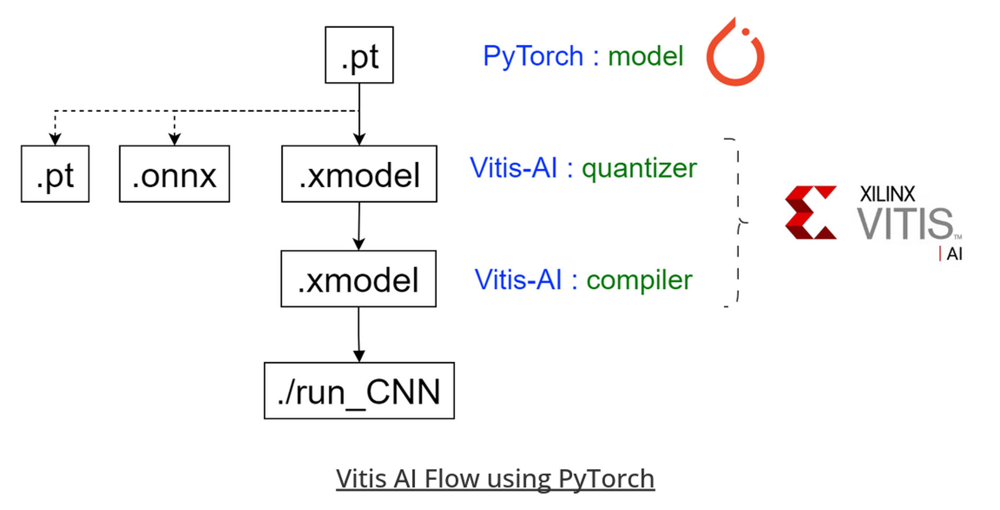

# Vitis AI

## What is Vitis AI?

Vitis AI is a comprehensive development platform provided by AMD (formerly Xilinx) for deploying artificial intelligence (AI) and machine learning (ML) models on edge devices, such as FPGAs (Field-Programmable Gate Arrays) and SoCs (System-on-Chips). It offers an end-to-end solution, encompassing tools for optimizing, quantizing, compiling, and deploying AI models on AMD's adaptable computing devices.

Vitis AI is used primarily for deploying AI and ML models on edge devices that require high performance, low latency, and energy efficiency.

All the following is the recommanded flow to work with Vitis AI 3.5.

In our case, we worked with PyTorch for AI training and inference.



## Requirements

- Ubuntu 22.04 host PC
- Vitis AI 3.5 repository
- Docker
- At least 100GB of free space

## Vitis AI installation

1. Clone the Vitis AI repository. This will retrieve the latest version of Vitis AI :
```
git clone https://github.com/Xilinx/Vitis-AI
cd Vitis-AI
```

2. Build Docker. In our case, with PyTorch and only using CPU :
```
cd docker
./docker_build.sh -t cpu -f pytorch
```

Alternatively, you can pull a pre-built Docker :
```
docker pull xilinx/vitis-ai-pytorch-cpu:latest
```
Rather than ```latest```, you can specify the version you want. Name of versions are available [here](https://xilinx.github.io/Vitis-AI/3.5/html/docs/reference/docker_image_versions.html).

Note that this process cann be a bit long.

## Use Vitis AI

Vitis AI has a lot of tools available but we will only use ```Quantizer``` and ```Compiler```. More information on other tools [here](https://www.xilinx.com/products/design-tools/vitis/vitis-ai.html).

### Initialisation

1. Start the Vitis AI Docker :
```
./docker_run.sh xilinx/vitis-ai-pytorch-cpu:latest
```

if you get the error ```docker: unknown server os```, launch the previous command in sudo :
```
sudo ./docker_run.sh xilinx/vitis-ai-pytorch-cpu:latest
```

To continue, copy the ```/tipu12``` folder into your Vitis AI repository.

2. Activate conda environment
```
conda activate vitis-ai-pytorch
cd tipu12/PyTorch-ResNet50/files
```

### Quantizer

First, you have to copy your test dataset and your weights :
- test dataset in ```tipu12/PyTorch-ResNet50/files/build/data```
- model weights in ```tipu12/PyTorch-ResNet50/files/build/float```

Then, modify ```tipu12/PyTorch-ResNet50/files/code/test.py``` to include your preprocessing.

To launch the quantizer :
```
./scripts/run_quant.sh dataset_name model_weight_name
```

This process can be long, especially if you have a lot of test images. These images are used for calibration and it is recommanded to have between 500 and 1000 of those.

Once over, you will find your quantized xmodel in the ```tipu12/PyTorch-ResNet50/files/build/quantized``` folder.

### Compiler

The compiler needs an arch.json file containing the architecture of your board. Some examples are provided in ```tipu12/PyTorch-ResNet50/files```.

To launch the compiler :
```
./scripts/run_compile.sh target quantized_xmodel
```

This process is quicker. You will find the compiled xmodel for your target in the ```tipu12/PyTorch-ResNet50/files/build/compiled``` folder.


You can now use this xmodel for your AI applications.